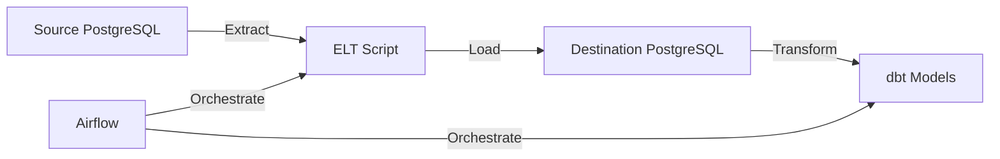

# 🚀 Modern ELT Pipeline with Airflow and dbt

A production-grade ELT (Extract, Load, Transform) pipeline demonstrating modern data engineering practices. This project showcases a complete data pipeline using industry-standard tools and best practices, suitable for real-world analytics and reporting use cases.

## ❓ Why This Project?

This project is designed to demonstrate:
- End-to-end data engineering with modern open-source tools
- Automated, scalable, and testable data workflows
- Best practices in orchestration, transformation, and containerization

## 🎯 Key Features

- **Modern ELT Architecture**: Implements the ELT pattern for better scalability and flexibility
- **Containerized Environment**: Fully containerized using Docker for consistent development and deployment
- **Automated Workflows**: Apache Airflow for robust workflow orchestration
- **Data Transformation**: dbt for version-controlled, tested data transformations
- **Security Best Practices**: Environment variables, secure configurations, and proper access controls
- **Monitoring & Logging**: Comprehensive logging and monitoring throughout the pipeline
- **Data Quality**: Built-in data quality tests and validations

## 🛠 Technology Stack

- **Python 3.8+**: Core programming language
- **PostgreSQL 15**: Source and destination databases
- **Apache Airflow 2.7.1**: Workflow orchestration
- **dbt 1.4.7**: Data transformation
- **Docker & Docker Compose**: Containerization
- **Git**: Version control

## 📊 Architecture



## 🚀 Getting Started

1. **Clone the Repository**
   ```bash
   git clone https://github.com/noshikchowdary/etl_pipeline_airflow.git
   cd etl_pipeline_airflow
   ```

2. **Set Environment Variables**
   ```bash
   export SOURCE_DB_NAME=source_db
   export SOURCE_DB_USER=postgres
   export SOURCE_DB_PASSWORD=your_password
   export SOURCE_DB_HOST=source_postgres
   
   export DESTINATION_DB_NAME=destination_db
   export DESTINATION_DB_USER=postgres
   export DESTINATION_DB_PASSWORD=your_password
   export DESTINATION_DB_HOST=destination_postgres
   ```

3. **Start the Services**
   ```bash
   docker-compose up --build
   ```

4. **Access the Airflow UI**
   - URL: http://localhost:8080
   - Username: airflow
   - Password: airflow

## 📂 Project Structure

```
├── airflow/               # Airflow configuration and DAGs
│   └── dags/             # Airflow DAG definitions
├── custom_postgres/       # dbt project
│   ├── models/           # dbt models
│   ├── tests/            # dbt tests
│   └── macros/           # dbt macros
├── elt/                  # ELT Python scripts
├── source_db_init/       # Source database initialization
├── docker-compose.yaml   # Docker services configuration
├── requirements.txt      # Python dependencies
└── README.md            # Project documentation
```

## 🔒 Security Features

- Environment variables for sensitive data
- Secure database connections
- Proper access controls
- No hardcoded credentials
- Docker security best practices

## 📈 Monitoring and Logging

- Structured logging throughout the pipeline
- Airflow task monitoring
- dbt run logs
- Database operation tracking
- Health checks for all services

## 🧪 Testing

- Unit tests for Python code
- dbt data tests
- Integration tests
- Data quality checks

📚 References

Chau, J. (n.d.). The all-in-one workspace for your notes, tasks, wikis, and databases. Notion.
https://transparent-trout-f2f.notion.site/FreeCodeCamp-Data-Engineering-Course-Resources-e9d2b97aed5b4d4a922257d953c4e759


